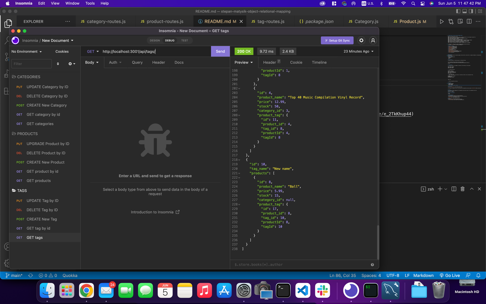

# Stepan Matysik's Object Relational Mapping (ORM)

> ORM project. A video with a object relational mapping project description.
> Live demo [_here_](https://youtu.be/e_2TkKhup44). 

## Table of contents
* [General info](#general-info)
* [Technologies](#technologies)
* [Installation](#installation)
* [Instructions](#instructions)
* [Features](#features)
* [Screenshots](#screenshots)
* [Usage](#usage)
* [Project Status](#project-status)
* [Room for Improvement](#room-for-improvement)
* [Acknowledgements](#acknowledgements)
* [Contacts](#contact)


## General Info
This project is a object relational mapping. Uses back end to create calls in ecommerce database to create/get/update/delete products/categories/tags.
## Technologies
Project is created with:
- JavaScript
- Node.js
- npm

## Installation
To open this project in vscode using git in Terminal/Git Bash:

```
$ cd in directory there you want to store your project
$ git clone https://github.com/elfsvet/stepan-matysik-object-relational-mapping.git
$ code .
```

## Instructions
1. You would need to run commands in terminal at the directory of the project:
```
$ npm init -y
$ npm i express
$ npm install --save mysql2
$ npm i sequelize
$ npm install dotenv
$ touch .env

```

2. To upload data bases:
```
$ mysql -u root -p
Enter your password:
mysql> source db/schema.sql;
mysql> quit;
$ npm run seed
```
3. To run application:
- Update the .env file in root directory, and paste your data in user and password filed.
```
DB_NAME='ecommerce_db'
DB_USER='username_mysql'
DB_PW='password_for_mysql'
```

```
$npm start
```

4. Go to the browser or insomnia to test the work of the app.


## Features
- Sequelize package
- Dotenv package
- Express package
- Router method of express package

## Screenshots


If you haven't checked the link to the video with the application process please [CLICK HERE ⬇️](https://youtu.be/e_2TkKhup44)


## Usage
For maintaining all products with categories and tags.
## Project Status
Project is: _complete_

## Room for Improvement
To do:
- UI/UX

## Acknowledgements
- This project was inspired by UM Coding Boot Camp
- This project was creating with [provided code](https://github.com/coding-boot-camp/fantastic-umbrella.git).


## Contact
Created by [@elfsvet](https://github.com/elfsvet)
- [LinkedIn](https://www.linkedin.com/in/stepanmatysik/)